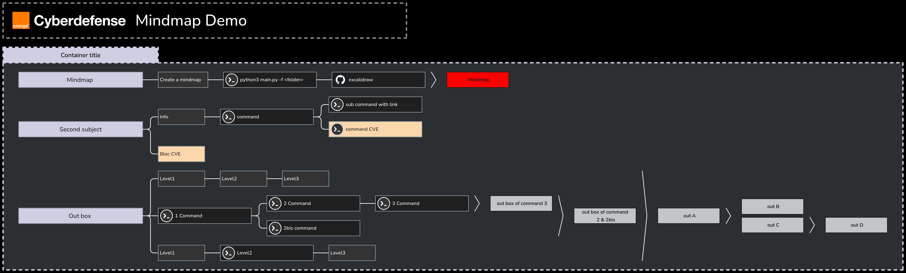
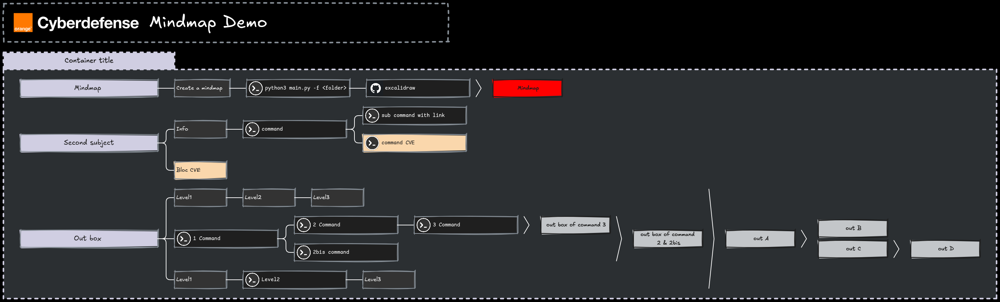
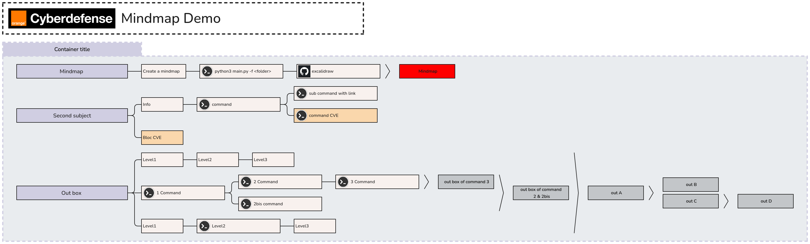
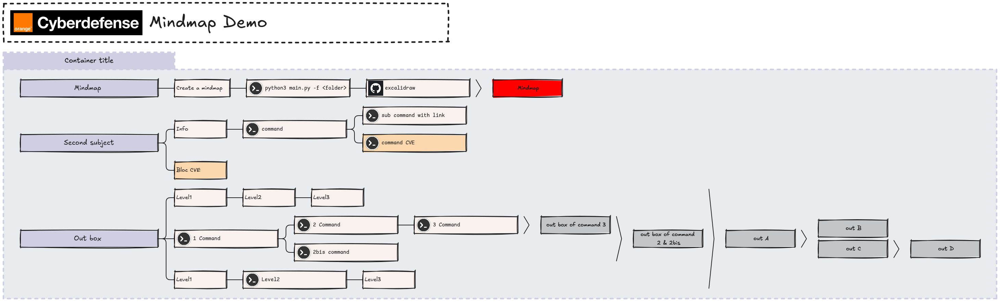

# Excalimap

- Mindmap creation with markdown to excalidraw

- usage:
```bash
python3 main.py -f mindmap_folder
```

- Visualisation: https://excalidraw.com/

## Example

- config file
```yml
main_title: Mindmap Demo
main_title_logo: ocd
matrix:
  - ['example']
tools:
  excalidraw:
    icon: github
    link: https://excalidraw.com/
color_id:
  demo: "#D0CEE2"
  mindmap: "#FF0000"
container_color:
  Container title: demo
out:
  out box: demo
  Mindmap: mindmap
```

- markdown file
```markdown
# Container title

## Mindmap >>> Mindmap
- Create a mindmap
  - `python3 main.py -f <folder>`
    - `excalidraw`

## Second subject
- Info
  - `command`
    - `sub command with link`
[https://example.com](https://example.com)
    - `command CVE` @CVE@
- Bloc CVE @CVE@

## Out box >>> out A >>> out B || out C >>> out D
- Level1
  - Level2
    - Level3
- `1 Command` >>> out box of command 2 & 2bis
  - `2 Command`
    - `3 Command` >>> out box of command 3
  - `2bis command`
- Level1
  - `Level2`
    - Level3
```

```bash
python3 main.py -f example
```

Result : 
- Dark / Classic : `python3 main.py -f mindmap/example`


- Dark / Handraw : `python3 main.py -f mindmap/example -s handraw`
  

- Light / Classic : `python3 main.py -f mindmap/example -t light -s classic`
  

- Light / Classic : `python3 main.py -f mindmap/example -t light -s handraw`
  